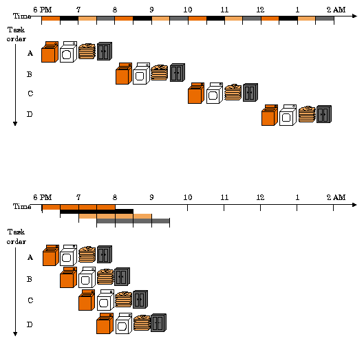

# 사용자를 위한 모나드 설명서

모나드는 엄청난 성능과 이더리움과의 완벽한 호환성을 자랑하는 L1입니다. 유저들에게 이동성과 성능 모두를 제공하죠.

### 이동성 관점에서 보면,
모나드는 이더리움 가상 머신(EVM)과 완벽하게 호환되기 때문에, 이더리움에서 만들어진 앱들을 코드 변경 없이 모나드로 옮길 수 있습니다.
즉, 많은 앱들이 큰 노력 없이 바로 모나드 생태계로 들어올 수 있다는 뜻이입니다!
이더리움 RPC 호환성 덕분에 MetaMask나 Etherscan 같은 인프라도 문제없이 사용할 수 있습니다.

### 성능 관점에서 보면,
모나드는 초당 10,000건의 트랜잭션 처리량, 즉 하루 10억 건의 트랜잭션을 소화할 수 있습니다. 1초 블록 시간과 1초 확정 시간을 제공하면서, 기존 블록체인보다 훨씬 많은 사용자와 훨씬 더 상호작용적인 경험을 지원할 수 있어요. 게다가 트랜잭션 비용도 훨씬 저렴합니다!

### 모나드가 익숙한 점은?
사용자 입장에서 보면, 모나드는 이더리움과 매우 비슷하게 동작합니다. 메타마스크 지갑을 써서 서명한다던지, 이더스캔과 같은 블록 익스플로러를 사용해서 조회하는 것들이니다. 또, 이더리움을 위해 만들어진 앱들도 코드 변경 없이 모나드로 옮길 수 있으니, 이더리움에서 좋아하던 많은 앱들을 모나드에서도 사용할 수 있습니다. 모나드의 주소는 이더리움과 동일하므로 기존 키를 재사용할 수도 있습니다.

이더리움처럼, 모나드도 탈중앙화된 검증자들이 운영하게 되는 지분 증명 네트워크입니다. 누구나 노드를 운영하여 트랜잭션 실행을 독립적으로 검증할 수 있고, 하드웨어 요구 사항을 최소화하기 위해 상당히 노력하고 있죠. (즉, 낮은 사양으로도 노드를 돌릴 수 있는 것을 목표로 합니다.)

### 모나드의 차별점은?
모나드는 이더리움 가상 머신에 병렬 실행과 슈퍼스칼라 파이프라이닝을 도입했고, 이것이 탁월한 성능을 가능하게 합니다.

병렬 실행은 여러 코어와 스레드를 활용하여 작업을 병렬로 수행하면서도 결과를 원래 순서대로 확인하는 방식입니다.
트랜잭션은 "내부적으로" 병렬로 실행되지만 사용자와 개발자에게는 연속적으로 실행되는 것처럼 보입니다.
따라서, 트랜잭션 시리즈의 결과는 항상 연속적으로 실행된 것과 같습니다.

슈퍼스칼라 파이프라이닝은 작업의 단계를 만들고 이 단계들을 병렬로 실행하는 방식입니다.
다음은 간단한 다이어그램으로 설명된 파이프라이닝의 예를 보여줍니다.

*파이프라이닝의 익숙한 예: 똑똑하게 빨래하기. 위: 순진한 방식; 아래: 파이프라인 방식. 출처: [로이스 호크스, FSU](https://www.cs.fsu.edu/~hawkes/cda3101lects/chap6/index.html?$$$F6.1.html$$$)*

네 번의 빨래를 할 때, 원래의 순진한 전략은 첫 번째 빨래를 세탁, 건조, 접기, 보관하는 것을 두 번째 빨래를 시작하기 전까지 모두 마치는 방법입니다.
파이프라인 전략은 첫 번째 빨래가 건조기로 갈 때 두 번째 세탁을 시작하는 것입니다. 스마트한 방법이죠? 
파이프라이닝이 여러 자원을 동시에 활용하여 작업을 더 효율적으로 수행하게 하는 것을 바로 알 수 있습니다.

모나드는 상태 저장, 트랜잭션 처리, 분산 합의의 기존 병목 현상을 해결하기 위해 파이프라이닝을 도입했습니다.
특히, 다음 네 가지 주요 영역에서 파이프라이닝과 다른 최적화를 도입했죠:

- **MonadBFT** (추가 연구로 개선된 파이프라인 HotStuff 합의)
- **지연 실행** (합의와 실행 사이의 파이프라이닝을 통해 실행 가능 시간을 크게 증가)
- **병렬 실행** (동시에 여러 트랜잭션을 실행)
- **MonadDb** (고성능 상태 백엔드 저장소)

모나드의 클라이언트는 C++ 및 Rust로 처음부터 새롭게 작성되었고, 위와 같은 구조적 개선을 반영했고, 진정한 확장성을 이루는 탈중앙화 앱을 제공할 수 있습니다.

### 왜 모나드가 중요한가요?
탈중앙화 앱은 중앙화 서비스에 비해서 여러 중요한 이점을 가지고 있습니다.

- **개방형 API / 조합성**: 탈중앙화 앱은 다른 탈중앙화 앱에 의해 호출될 수 있고, 개발자들이 기존 컴포넌트를 마음대로 쌓아 더 복잡한 기능을 구축할 수 있습니다.
- **투명성**: 앱 로직은 100% 코드를 통해 표현되므로 누구나 리뷰할 수 있습니다. 상태는 투명하고 누구에게나 감사 가능하며, DeFi에서 잔고를 투명하게 증명할 수 있는 것은 매우 중요합니다.
- **검열 저항 및 신뢰할 수 있는 중립성**: 누구나 트랜잭션을 내거나, 앱을 허가 필요 없이 배포할 수 있습니다.
- **글로벌 연결**: 인터넷에 접속할 수 있는 누구나 중요한 금융 서비스를 이용할 수 있으며, 은행 계좌가 없는 사용자에게도 마찬가지입니다.

탈중앙화 앱은 의도한 수준의 영향을 미치기 위해서는 저렴해야하고 성능이 뛰어난 인프라가 절대적으로 필요합니다.
일일 활성 사용자(DAUs)가 100만 명이고, 사용자당 하루 10건의 트랜잭션을 필요로 하는 하나의 앱은 하루에 1천만 건의 트랜잭션, 즉 100tps가 필요하죠.
그런데 L2Beat(기존 EVM 호환 L1과 L2의 처리량을 보여주는 사이트)를 보면, 현재 어떤 EVM 블록체인도 그 수준의 처리량을 지원하지 않습니다.
(역자주: 물론 이건 트랜잭션이 그만큼 많지 않아서일 수도 있음)

모나드는 EVM 호환 블록체인 네트워크의 성능을 크게 개선하게 될 것이고, 앞으로 몇 년 동안 이더리움에서 표준이 될 수 있는 혁신들을 이끌게 될 것입니다.
모나드에서 개발자와 사용자들은 EVM을 위해 구축된 기존의 앱, 라이브러리, 인프라 등 풍부한 자산을 그대로 사용할 수 있습니다. (이더리움과의 호환성에서 오는 것이니 당연한 것일 것입니다!)

### 모나드를 어떻게 사용하나요?

모나드의 첫 번째 공개 테스트넷은 몇 달 내에 출시될 예정입니다.
그 때는, 메타마스크 같은 이더리움과 호환되는 지갑에 RPC 주소와 ChainId를 추가하고 모나드를 사용할 수 있습니다.